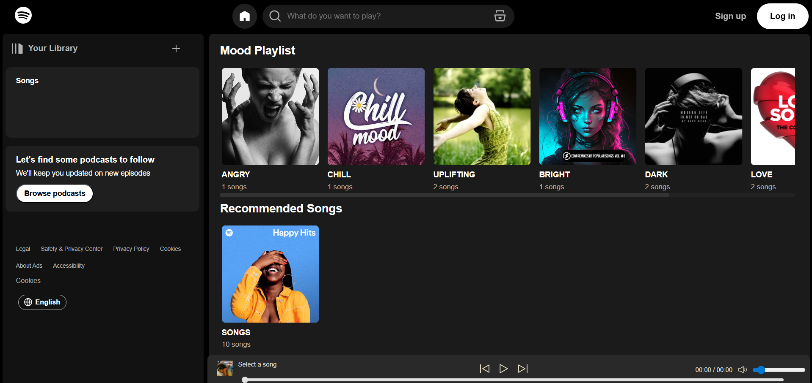
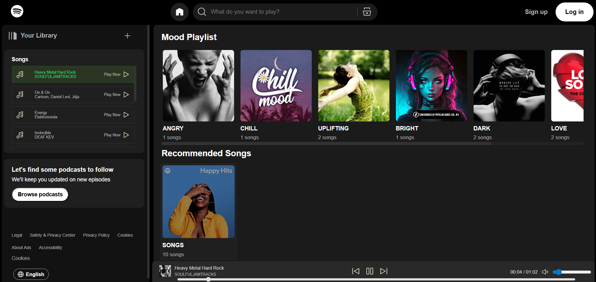
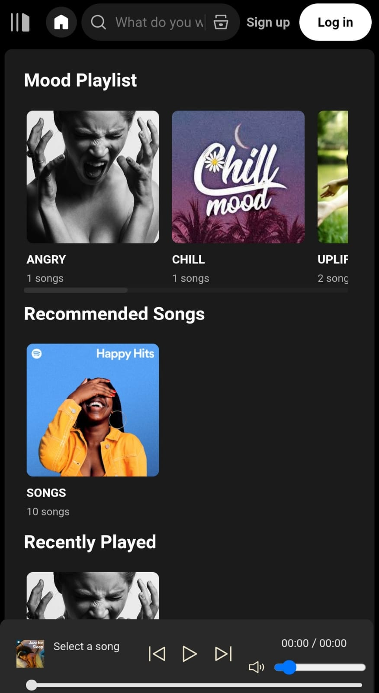
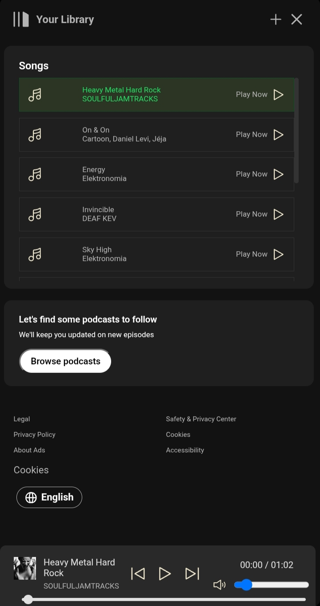

# 🎵 Spotify Clone

A fully functional Spotify-inspired music player built using **HTML, CSS, and Vanilla JavaScript**.  
Focused on recreating Spotify-inspired UI/UX and implementing core music player functionality from scratch using Vanilla JavaScript.

## Preview

### Desktop View

<div style="display:flex; gap:20px; justify-content:center">
  
  
</div>

---

### Mobile View
<div style="display:flex; gap:20px; ">
  

  
</div>

---

## 🚀 Features

### 🎧 Music Player
- Play / Pause / Next / Previous controls
- Seekbar with real-time progress tracking
- Volume control with mute toggle
- Active song highlighting

### 📂 Library & Playlists
- Mood-based playlists (Angry, Chill, Dark, Funky, Uplifting, etc.)
- Dynamic playlist loading using JSON
- “Recently Played” section using `localStorage`
- Auto-update UI when song changes

### 🔍 Search Functionality
- Real-time search (title + artist)
- Instant filtering without reload
- Works across all playlists
- Mobile-friendly UX handling

### 📱 Responsive Design
- Collapsible sidebar (desktop & mobile)
- Fixed bottom playbar (Spotify-style)
- Horizontal scrolling cards
- Optimized for small screens

---

## 🧠 Technical Highlights

- Built completely with **Vanilla JavaScript (no frameworks)**
- Custom state management using:
  - `currentPlaylist`
  - `currentIndex`
  - `searchBase`
- Efficient DOM updates
- Event-driven architecture
- `localStorage` integration for persistence
- JSON-based data system for scalability

---

## 🛠️ Tech Stack

- HTML5
- CSS3
- Vanilla JavaScript (ES6)
- JSON
- LocalStorage

---

## ⚙️ Setup

```bash
git clone https://github.com/aaryavikasboya/spotify-clone.git
cd spotify-clone
```

Open `index.html` in your browser  
or use Live Server for better experience.

---

## ⚠️ Disclaimer

This project is built for educational and portfolio purposes only.  
It is inspired by Spotify and is not affiliated with the official platform.

---

## 🎶 Music Credits

This project uses royalty-free music from:

- NoCopyrightSounds (NCS)
- Pixabay Music
- Free Music Archive

All tracks belong to their respective creators, are used under their respective licenses and used for educational and non-commercial purposes.

---

## 🛠️ Future Improvements

- Shuffle & Repeat functionality
- Playlist creation & management
- Backend integration (Node.js + MongoDB)
- User authentication system
- Streaming API instead of static files

---

## 👨‍💻 Author

**Aarya Vikas Boya**  
Frontend Developer 

---
## Badges


---

⭐ If you found this useful, consider giving it a star!